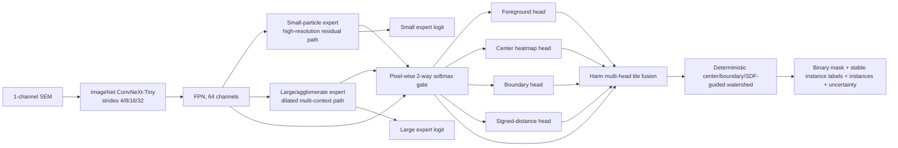

# NanoLoop-MSBI instance-segmentation implementation report

> Superseded status, 2026-07-25: the Stage A–F result documented below is retained as historical
> evidence. Efficient anchored Stage I later passed all nine strict validation-superiority checks
> (Dice 0.7513, boundary F1 0.5911, pseudo-instance F1 0.7608, PQ 0.6313, count MAE 4.9444,
> mean/P95 362.1/419.2 ms). Stage J then produced a faster validation-successor candidate
> (Dice 0.7478, boundary F1 0.5837, pseudo-instance F1 0.7579, PQ 0.6277, count MAE 4.5556,
> mean/P95 267.2/379.3 ms). Stage J is now installed as the local runtime-selectable MSBI weight.
> Stage I's one-shot independent test did not beat both existing U-Nets on every metric, and Stage J
> has no fresh blind holdout yet, so the final scientific recommendation remains blocked. See the
> model card and progress log for the current decision.

## Executive result

Status: **FORMAL TRAINING COMPLETE; SCIENTIFIC GATE FAILED**.
`msbi-instance-balanced-v1` is implemented, formally trained through stages A–F on CUDA, strictly
exported, validation-calibrated, and integrated behind a fail-closed `unavailable` registry entry.
The final candidate beat the Small U-Net on Dice and connected-component pseudo-instance F1 but
missed the frozen count and boundary tolerances. The independent test was not opened and
`ready_recommendation=false`.

This is an engineering-complete research candidate, not a scientifically accepted production
model.

## 1. Source, branch and environment

- Baseline commit: `7f22e9338a29fca59f82f8138eefe42bad63a316`.
- Working branch: `codex/msbi-instance-seg-v1`.
- Development host: Apple Silicon arm64, macOS 15.5, Apple M4 MacBook Air, 24 GB unified memory.
- Formal host: eight RTX 4090 GPUs; physical GPU 2 was used without interfering with other jobs.
- Formal runtime: Python 3.12, NVIDIA driver `570.211.01`, CUDA driver API 12.8,
  `torch==2.11.0+cu128`, and `torchvision==0.26.0+cu128`.
- A real BF16 CUDA allocation rejected the initially resolved `torch 2.13.0+cu130` wheel because
  the driver was too old for that build. Training began only after a dedicated compatible CUDA
  12.8 environment passed allocation and compute checks.

## 2. Private data, authorization and manifests

The final delivery archive `yukun_.zip` has SHA-256
`ad9118c9a300df0476d8be03a71f41b0b887cf4317aac18fe9ed605e15ee6f40`.
It supplied authoritative train/test tables, 93 official training views, 90 training masks and 9
independent-test views/masks. `SrZn-1/2/3` lack masks and were used only for high-confidence U-Net
teacher distillation.

Raw SEM, masks, derived targets, teacher maps, checkpoints and TorchScript files stay outside Git.
The owner authorized use for this task; redistribution and checkpoint-distribution permission are
undocumented.

| Artifact | SHA-256 |
|---|---|
| split manifest | `c1d1605018162e263ea46b6cea0e9f1472c2c6882b8d36ad6f330d6393bf7d36` |
| official train table | `b903f0178edd6749fa80f70e41bdb156257b0494ea4ea59168ea8dcfcd52cb4b` |
| official test table | `7d1247b762436453cfc9117c31bc9ee6a27e195319067bc4533feda105d4db4b` |

The split contains 75 train, 18 validation and 9 sealed independent-test views. Validation uses
material-group splitting inside the official train pool; patches never cross splits. Exact official
train/test filenames do not overlap, but material tokens `BaCu`, `PrCu`, and `SrZr` occur on both
sides and remain a documented delivery-level risk.

All current views are `1536×2048`. The bottom 128 rows are excluded per record based on an audit of
all labeled training views. Physical scale is unknown and is not inferred.

## 3. Ground-truth limitation

GT is a binary semantic mask. Connected components generate pseudo-instance IDs, center targets,
boundaries, SDF and scale classes. Therefore instance F1, PQ, count and diameter metrics in this
report measure connected-component pseudo-instances. They do not establish human touching-particle
separation, confidence-ranked AP50/AP75, or physical nm accuracy.

## 4. Architecture

The RGB ConvNeXt stem is converted to one channel by averaging its three pretrained filters. The
actual torchvision ImageNet revision is recorded by the training manifest. All seven dense outputs
are fused across tiles; the Adapter does not fuse only foreground.

Complexity:

- parameters: 28,623,080;
- trainable in the frozen-encoder Pilot: 807,560;
- hook-counted Conv2d/Linear work per `256×256` patch: 7.654 GMAC;
- approximate multiply-plus-add work: 15.3 GFLOP;
- interpolation, normalization, activation and watershed work are excluded from this estimate.

## 5. Targets, loss and augmentation

Targets include foreground, adaptive Gaussian centers, instance boundary, normalized per-instance
distance, and training-derived scale class. Loss is a validity-masked weighted sum of:

- focal + Dice foreground;
- weighted center BCE;
- focal + Dice boundary;
- differentiable contour consistency in corrective Stage F;
- Smooth L1 SDF;
- scale-supervised gate and balance terms;
- high-confidence Small/Large teacher distillation;
- an optional consistency hook.

Augmentation provides shared geometric transforms, brightness/contrast/gamma, noise, bounded stripe
artifact, blur, density-aware crop sampling, and a collision-safe same-domain instance Copy-Paste
primitive. Copy-Paste is implemented/tested but not enabled in the corrective Pilot.

An initial Pilot revealed that geometric flip decisions were incorrectly drawn once per modality.
That could spatially misalign the SEM and targets. The original failed run is preserved; the code
now draws one rotation and one pair of flips for the entire sample, with a regression test.

## 6. Teachers

The current production Small and Large U-Nets are teacher models. Teacher caching records exact
weight/config hashes and only distills high-confidence pixels. For the three unlabeled `SrZn`
training views, Small and Large predictions are intersected with their valid regions; GT loss is
zero there. Teachers never read the independent test.

## 7. Formal staged training

Only the 75-record train and 18-record validation material were transferred to the CUDA host. The
nine independent-test records and pixels were absent. The sealed A–E orchestrator used seed 2026,
BF16 AMP, EMA, warm-up/cosine scheduling, gradient clipping, early stopping, exact initialization
hashes and complete run manifests.

| Stage | Main change | Best validation loss | Checkpoint SHA-256 |
|---|---|---:|---|
| A | single expert, frozen encoder | 1.651945 | `3f5da314f423afdfa4f07c1164ea327b2bf3758b4b8bb9e0ee6102f88bf42814` |
| B | dual experts, fixed mean | 0.803364 | `929876b3c89256c9aa58f603465042fc2a8dde4316207a938628af971a935435` |
| C | learned gate | 0.790850 | `0697f1d2fc2095cc4eb0b7bfe7fd6d63643d577d2b33b52692db028bc6d8546b` |
| D | encoder unfreeze + distillation | 0.731599 | `3052f1d69fefb4da01abf15c671ffd09f4b762eec5f572733a141f00e5a933a4` |
| E | signed-distance supervision | 0.731320 | `ea287f63c6a38dbd2a0868128124286657ca1666a6a7bc19737bd418c2d4e989` |

Corrective Stage F initialized from Stage E and used `512×512` patches, 768 training and 192
validation patches per epoch, morphology-balanced sampling, contour consistency, higher
foreground/boundary weights, batch size 2 with four-step accumulation, EMA 0.998, and low
encoder/head learning rates. It early-stopped after epoch 6; epoch 0 was retained as best.
Its checkpoint SHA-256 is
`2aab2acb179cf6826f444c5e22a53d21df6f8393ed79107daa325ad4a963dad1`.

## 8. Same-split baselines and corrected candidate

All rows use the same 18 validation views, validity masks and pseudo-instance metric definition.

| Model | Pixel Dice | IoU | Boundary F1 | HD95 px | Instance F1@0.5 | PQ | Count MAE | Diameter W1 px | Runtime ms |
|---|---:|---:|---:|---:|---:|---:|---:|---:|---:|
| Small U-Net | 0.7465 | 0.6479 | 0.5817 | 158.38 | 0.7184 | 0.5944 | 7.2222 | 17.1027 | 2348.7 |
| Large U-Net | 0.6664 | 0.5378 | 0.3874 | 176.45 | 0.5996 | 0.4857 | 17.1111 | 9.4943 | 1562.9 |
| MSBI Stage D | 0.7352 | — | 0.4557 | — | 0.7185 | — | 10.3889 | — | 4284.6 |
| MSBI Stage E | 0.7435 | — | 0.4601 | — | 0.7218 | — | 10.2222 | — | 4808.1 |
| MSBI Stage F, prior decoder | 0.7636 | — | 0.4855 | — | 0.7461 | — | 9.2778 | — | 4367.2 |
| MSBI Stage F, calibrated | 0.7625 | 0.6353 | 0.4882 | 136.07 | 0.7674 | 0.6125 | 7.7222 | 11.1609 | 4208.6 |

The final mean gate was 0.640 small / 0.360 large, so routing did not collapse. Stage F beat the
Small U-Net on Dice and pseudo-instance F1, but its count MAE and boundary F1 remained worse.

The final validation-only search evaluated 168 decoder combinations and froze foreground threshold
0.85, center threshold 0.50, center NMS radius 13, and minimum area 256 px. Its rule prioritized
all-policy passage and then the minimum relative frozen-policy margin. No combination passed all
four scientific rules. All calibration tables are machine-readable and no independent-test pixels
were accessed.

The worst patterns are concentrated in difficult large/agglomerated views: merges, over-segmentation
and weak semantic boundaries drive count and boundary failures. Strong small-particle examples do
not compensate for those macro errors.

## 9. Frozen tolerance policy and test status

Before any independent-test access, policy
`264265bbf80c23d7d20f611b6cf6f757aa7792c04747ddfde7bc22ba749930ec` was frozen
relative to the Small U-Net:

| Rule | Threshold | Candidate | Result |
|---|---:|---:|---|
| instance F1@0.5 | ≥ 0.7384 | 0.7674 | pass |
| count MAE | ≤ 6.8611 | 7.7222 | fail |
| pixel Dice | ≥ 0.7265 | 0.7625 | pass |
| boundary F1 | ≥ 0.5617 | 0.4882 | fail |
| mean full-image runtime | ≤ 8206 ms | 4208.6 ms | pass |
| each mean gate | ≥ 0.10 | 0.640 / 0.360 | pass |

Validation gate status: `FAILED`. Independent test status:
`SEALED_NOT_ACCESSED`. No independent-test metrics exist. The test entrypoint was exercised with a
failed gate and a deliberately nonexistent manifest; it returned before opening the manifest.

## 10. Export and Adapter verification

Final Stage F TorchScript SHA-256:
`c430a8c94a5798c7e111860ea957c09f512a44f9b9e14cf1e4c8c38bbd5cc57f`.

- strict checkpoint load: pass; no missing/unexpected keys;
- eager vs TorchScript maximum absolute difference: 0;
- repeated TorchScript patch inference maximum difference: 0;
- all seven outputs finite and `1×C×512×512`;
- actual exported Adapter CUDA full-view validation: pass;
- repeated full Adapter labels: identical;
- bottom-invalid labels: zero;
- full validation used the production Adapter's Hann-tiled, multi-head watershed path.

The independent `MSBIAdapter` writes foreground, center, boundary, SDF, experts, gate maps,
uncertainty, stable label map, binary mask, native instance NPZ and JSON. Full-image and boxes
validity masks are supported.

## 11. NanoLoop and frontend integration

The existing U-Net behavior is unchanged. `ModelFamily.MSBI` and a separate Adapter registration
were added. Analysis already consumes canonical model NPZ instances when present; MSBI uses that
path, while semantic U-Nets keep existing postprocessing. Auxiliary artifact paths are persisted and
exposed through the API.

The existing result page gained optional center, boundary, instance-label, small/large-gate and
uncertainty layers. OpenAPI and the generated TypeScript schema were refreshed. The model remains
`unavailable`, so a production Analysis E2E through a ready registry was intentionally not claimed.

## 12. Verification

Completed checks at report time:

- Ruff: pass; Mypy: 128 source files, pass;
- Pytest: 1435 passed, 1 controlled private-bundle test skipped;
- Alembic round-trip and metadata drift: pass;
- MSBI/registry focused unit tests: 26 passed;
- frontend dependency audit: no known production vulnerabilities;
- frontend TypeScript and ESLint: pass;
- frontend Vitest: 21 files / 103 tests passed;
- Next.js production build: pass;
- Playwright: 6 passed;
- Docker Compose configuration: pass;
- OpenAPI and TypeScript schema regeneration: byte-identical.

The aggregate `make check`/`pnpm check` wrappers stopped at their `git diff --exit-code` contract
checks because the expected generated OpenAPI/schema changes are not committed on this feature
branch. All substantive subchecks and deterministic regeneration checks passed separately. The
available Node 26 runtime is outside the declared Node 24 engine range and emitted warnings; the
production build and browser suite still passed.

TorchScript emits upstream PyTorch deprecation warnings because PyTorch 2.13 now recommends
`torch.export`; the current repository contract still requires TorchScript.

## 13. Acceptance, incomplete work and risks

Scientific acceptance: **FAIL**. Engineering/runtime integration: **implemented and locally
verified**. Production readiness: **false**.

Required continuation:

1. Obtain human instance IDs for touching/agglomerated particles; binary connected components cannot
   supervise the separation error that now dominates.
2. Add a boundary-aware instance objective or sparse manual center/boundary annotations and rerun
   Stage F from the formal checkpoint.
3. Repeat the strongest configuration across multiple seeds.
4. Re-run the unchanged validation gate. Only a passing candidate may open the independent test.
5. Obtain checkpoint redistribution approval and explicit owner approval before any `ready` change.

Known risks include small sample size, pseudo-instance supervision, teacher bias, material-token
train/test overlap in the delivered split, unknown physical scale, missing masks for three views,
and single-seed formal evidence.

## 14. Rollback

The implementation is isolated on `codex/msbi-instance-seg-v1`. Rollback is to omit/revert this
branch or remove the `unavailable` MSBI registration and auxiliary UI/API fields. No existing U-Net
weights, IDs, thresholds or Adapter behavior were replaced. Private checkpoints can be deleted from
the external asset root independently; no database migration or Docker volume deletion is needed.

## 15. Recommended PR

Title:

`feat(models): add validation-gated NanoLoop-MSBI research pipeline`

Body:

> Implements a ConvNeXt-FPN dual-expert, center/boundary/SDF/contour instance candidate with
> deterministic watershed, formal staged CUDA training, strict export, validation-only calibration,
> private-data manifests, failure analysis, an independent MSBI Adapter, optional result layers, and
> fail-closed test gating. The final Stage F candidate passed five of seven checks but missed count
> and boundary tolerances, so the registry remains unavailable, independent-test pixels were not
> accessed, no checkpoint is committed, and ready is not recommended.
